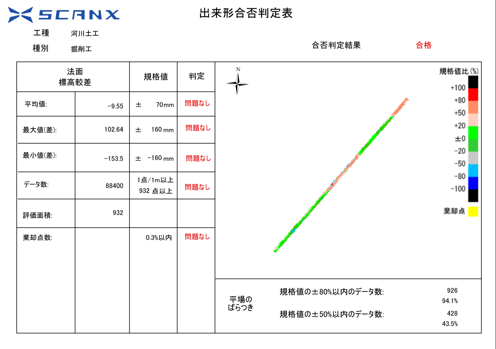

# Design vs As-Built ( Japanese Standard )

## Description


This stand-alone python scripts ouputs As-Built Management Form PDF from LAS dataset and LandXML dataset.

As-Built Management Form PDF follows the rule set by the Ministry of Land, Infrastructure, Transport and Tourism in Japan.

Surveyors, constructors etc in Japan needs to follow this form to show their design vs as-built of their building structure to their client.

LAS file and LandXML file is fed into this code to create a raster image that indicates design vs as-built.

The result of design vs as-built is statistically calculated following the rule and set to PDF output.


#### excerpt of japanese format
https://www.pref.yamagata.jp/documents/18357/24_re-za-dekigata.pdf

  

## Demo



  
  

## Requirement

- ArcGIS PRO ( arcpy library )

- Windows server

  

## Usage

```

~\ArcGIS\Pro\bin\Python\Scripts>propy.bat "~\design_vs_as_built.py" inputLas inputLandXML type method area cellFill

```

### Parameters

| index | parameter |description|
|--|--|--|
| 1 | inputLas | Input path of LAS file. Above 10cm resolution is preferred. The coordinates must be aligned with the LandXML file. |
| 2 | inputLandXML | Input path of LandXML file. The coordinates must be aligned with the LAS file. |
| 3 | type | The type of the construction.   |
| 4 | method | The method of the construction.  |
| 5 | area | The area of the construction. |
| 6 | cellFill | How you thin LAZ format  |

#### Construction type
| type | method | area |
|--|--|--|
| road | cut | ground, slope|
| | fill | crown, slope |
| riverbed | cut | ground, slope |
|  | fill | crown, slope |
| pavement | not ready | - |

  